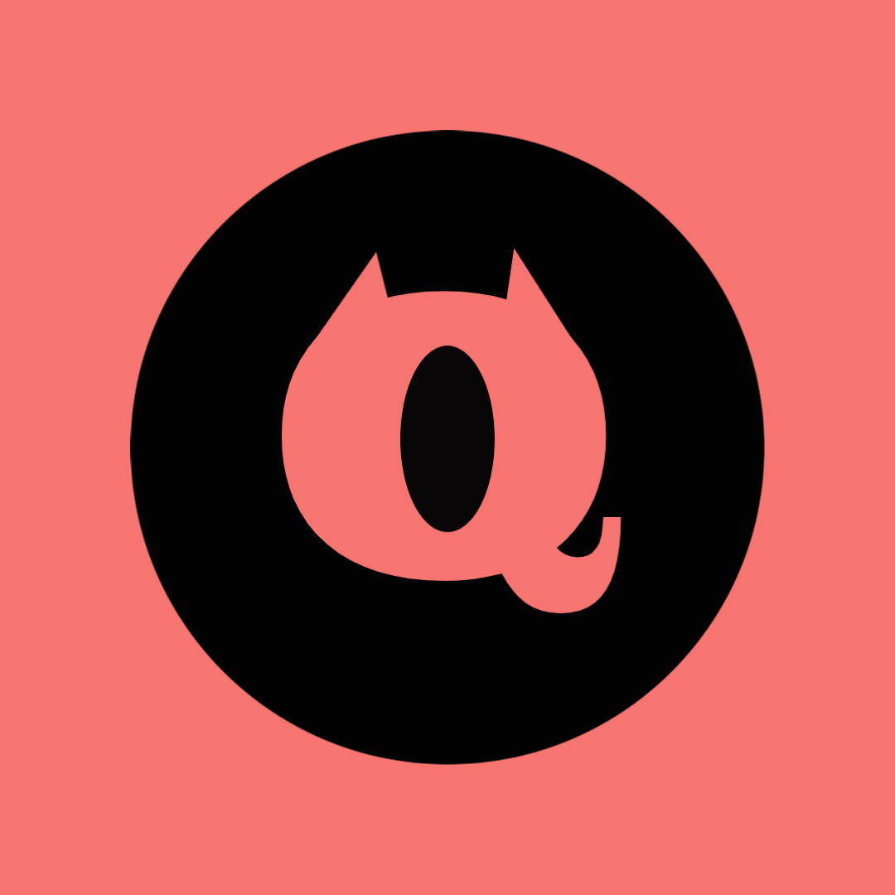

- 👋 Hi, I’m @Qark-dev
- 👀 I’m interested in Full stack web development
- 🌱 I’m currently learning
  * express on nodejs 
  * egui on rust 
  * react with typescript 
- 🔨 My toolset comprises of Git, Docker and Kubernetes, and vscode.  I use Arch Linux as my daily driver btw

[]
  
- 💞️ I’m looking to collaborate on open source projects within my current skill level
- 📫 You can reach me via my [website](website), my [linkedin](linkedin) or just here on [github](github)

<!---
Qark-dev/Qark-dev is a ✨ special ✨ repository because its `README.md` (this file) appears on your GitHub profile.
You can click the Preview link to take a look at your changes.
--->

[linkedin]: https://www.linkedin.com/in/qark-dev-5079a8239
[github]: https://github.com/Qark-dev
[website]: https://www.qatto.dev
[twitter]: https://twitter.com/qark_dev